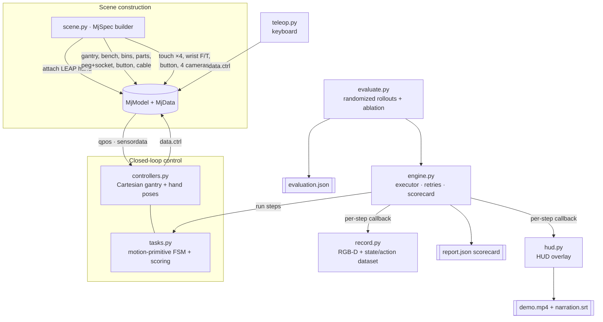

# Architecture

The DexAssembly Cell is a small, layered Python package around a single
procedurally-built MuJoCo model.

## System diagram

## Modules

| Module | Responsibility |
|---|---|
| `dexassembly/scene.py` | Build the whole cell with `mujoco.MjSpec`; attach the LEAP hand to the gantry wrist; add bench, bins, parts, peg/socket, spring button, deformable cable, sensors, and cameras. Emits `scene.xml`. |
| `dexassembly/controllers.py` | `CellController`: affine Cartesian map from gantry controls to the grasp-centre; symbolic hand-pose presets over the 16 LEAP actuators; tactile and wrist-F/T readouts. |
| `dexassembly/tasks.py` | `Step` motion primitives, per-task `score()`/`monitor()`, the six task builders, and `default_arena()`. |
| `dexassembly/engine.py` | Executes tasks step-by-step, drives `data.ctrl`, advances on conditions/timeouts, runs **checkpoint/verify recovery**, streams a per-step callback, and produces the scorecard. |
| `dexassembly/record.py` | Samples states/actions/forces and periodic RGB-D frames into a labelled dataset. |
| `dexassembly/hud.py` | Draws the demo HUD (task/phase, tactile bars, grip, progress, captions). |
| `dexassembly/evaluate.py` | Domain-randomized rollouts; adaptive-vs-open-loop ablation; `evaluation.json`. |
| `dexassembly/teleop.py` | Keyboard teleoperation via the MuJoCo passive viewer. |
| `run_demo.py` | One-command entry point: arena → HUD video + dataset + report. |
| `validate.py` | Self-check that the submission is complete and the model is well-formed. |

## Control model

The gantry is a pure Cartesian translation (`gx, gy, gz`) plus a wrist yaw. The
world position of the grasp centre is therefore an **affine function** of the four
gantry controls; `CellController` calibrates the constant offset once (from the
closed-grasp fingertip convergence point) and inverts it, so a task can command a
world `(x, y, z, yaw)` directly. The hand is commanded with five symbolic poses
(`open, pregrasp, grasp, pinch, point`) mapped onto the 16 LEAP position servos.

Every task is a list of `Step`s. A step sets a gantry target (static, or a
`target_fn` computed from live state) and/or a hand pose, then runs until a
**condition** (tactile/sensor trigger) or a timed phase elapses. A step may carry a
`verify` predicate and the engine will **retry from the last `checkpoint`** if it
fails — this is the grasp-failure recovery.

## Physics integrity

All motion is produced by **position actuators and contact dynamics**; the code
never writes `data.qpos` to move the robot. Parts are free bodies under gravity
that rest on the bench, and a grasp only holds when the fingers physically close
(confirmed by the fingertip touch sensors and by the part rising during the lift).
